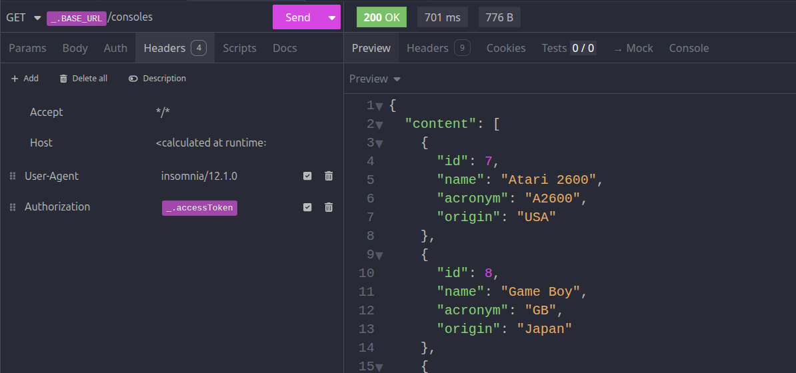
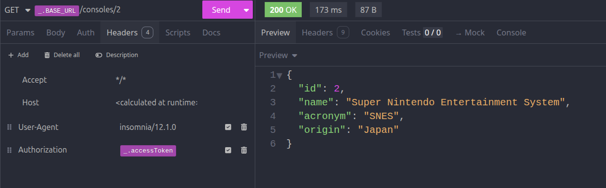
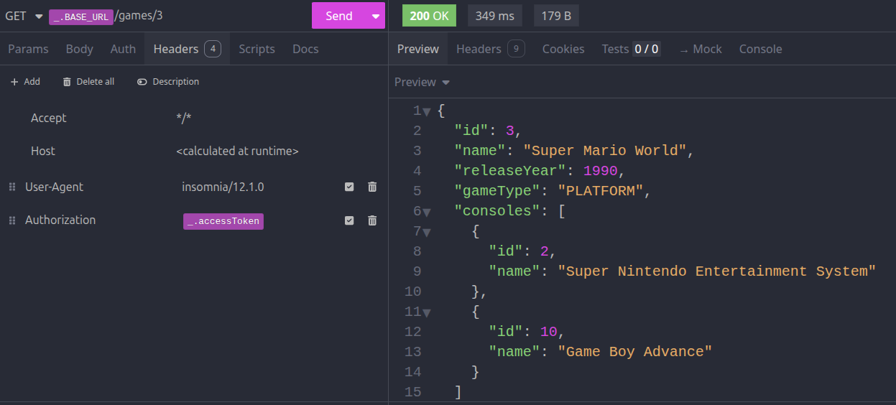
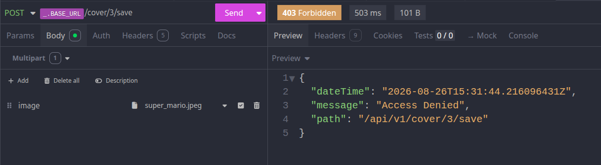

# 🎮 RetroGamePlatform API

---

> A RESTful API built with Spring Boot to catalog, organize, and preserve the nostalgia of classic video games and consoles.

---
<div align="center">
    
    
<br><br>
    
    
</div>

## 💡 About the Project

**RetroGamePlatform** was created to serve as a scalable backend for retro gaming collection management. It allows you to register and query classic consoles, manage game titles (including associating multiple consoles and cover art), and manage player accounts and access controls.

The application features a security structure based on **JWT (JSON Web Token)** and **RBAC (Role-Based Access Control)**, ensuring that regular users, administrators, and owners have the appropriate access levels.

---

## 🛠️ Tech Stack & Tools

- **Language:** Java 21
- **Framework:** Spring Boot 4.x
- **Security & Auth:** Spring Security + Auth0 `java-jwt`
- **Database & Migrations:** MySQL + Flyway Migration
- **API Documentation:** SpringDoc OpenAPI 3.x (Swagger UI)
- **Productivity Tools:** Lombok & Maven

---

## 🔐 Access Control (Roles & Permissions)

The API uses JWT token authentication with three permission levels:

| Role | Scope & Permissions |
| :--- | :--- |
| **`ROLE_BASIC`** | Standard read-only profile. Can search for games, consoles, and manage their own player profile. |
| **`ROLE_ADMIN`** | Administrative profile. Can create, update, and delete consoles, games, and manage relationships between them. |
| **`ROLE_OWNER`** | Ownership profile. Dedicated permissions to upload and manage game cover media assets. |

---

## 📍 API Endpoints

### 🕹️ Consoles (`/api/v1/consoles`)
| Method | Endpoint | Access Role | Description |
| :--- | :--- | :--- | :--- |
| `GET` | `/api/v1/consoles` | `BASIC` | List all consoles with pagination |
| `GET` | `/api/v1/consoles/{id}` | `BASIC` | Retrieve a single console by ID |
| `GET` | `/api/v1/consoles/name_contains/{part}` | `BASIC` | Filter consoles by name containing query string|
| `POST` | `/api/v1/consoles` | `ADMIN` | Register a new console|
| `PATCH` | `/api/v1/consoles/{id}` | `ADMIN` | Update console details |
| `PATCH` | `/api/v1/consoles/remove_acronym/{id}` | `ADMIN` | Remove the acronym/abbreviation from a console |
| `DELETE` | `/api/v1/consoles/{id}` | `ADMIN` | Delete a console |

---

### 🎲 Games (`/api/v1/games`)
| Method | Endpoint | Access Role | Description |
| :--- | :--- | :--- | :--- |
| `GET` | `/api/v1/games` | `BASIC` | List games with pagination |
| `GET` | `/api/v1/games/{id}` | `BASIC` | Get details of a specific game |
| `GET` | `/api/v1/games/name_contains/{part}` | `BASIC` | Search games by partial name |
| `GET` | `/api/v1/games/console/{id}` | `BASIC` | Filter games available for a specific console ID |
| `GET` | `/api/v1/games/type/{type}` | `BASIC` | Filter games by genre or type |
| `POST` | `/api/v1/games` | `ADMIN` | Register a new game |
| `PATCH` | `/api/v1/games/{id}` | `ADMIN` | Update game details |
| `PATCH` | `/api/v1/games/{id}/add_consoles` | `ADMIN` | Associate additional compatible consoles to a game |
| `PATCH` | `/api/v1/games/{id}/remove_consoles` | `ADMIN` | Remove console associations from a game |
| `DELETE` | `/api/v1/games/{id}` | `ADMIN` | Delete a game |

---

### 🖼️ Game Covers (`/api/v1/cover`)
| Method | Endpoint | Access Role | Description |
| :--- | :--- | :--- | :--- |
| `POST` | `/api/v1/cover/{id}/save` | `OWNER` | Upload game cover image (`multipart/form-data`) |
| `DELETE` | `/api/v1/cover/game/{id}` | `OWNER` | Remove game cover image |

---

### 👤 Players (`/api/v1/players`)
| Method | Endpoint | Access Role | Description |
| :--- | :--- | :--- | :--- |
| `GET` | `/api/v1/players/email` | `BASIC` | Find player profile by email address |
| `POST` | `/api/v1/players` | `BASIC` | Register a new player |
| `DELETE` | `/api/v1/players` | `ADMIN` | Remove a player account |

---

## ⚙️ Getting Started

### Prerequisites
- **Java 21 SDK** installed.
- Running instance of **MySQL**.
- **Maven** installed (or use the provided `./mvnw` wrapper).

### 1. Configuration & Properties
Make sure to specify your media directory in `application.properties` or environment variables:
```properties
storage.dir=/path/to/your/covers/storage
```

### 2. Running in Development Mode

The application includes a dev profile configured to wipe and re-run Flyway database migrations upon boot:  
Bash
```bash
./mvnw spring-boot:run -Dspring-boot.run.profiles=dev
```

### 3. API Documentation

Once running, explore and test the API directly via Swagger UI:
👉 http://localhost:8080/swagger-ui.html

---
## Developed by: Maraísa Ferreira 🚀

<br><br><br>
